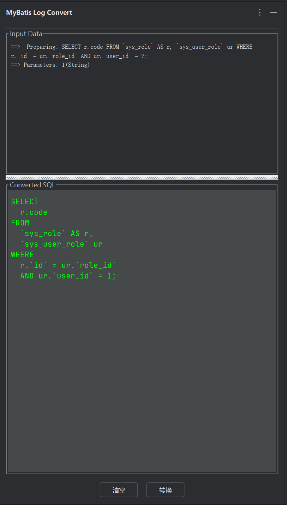

# MyBatis Log Converter

Convert mybatis sql logs into executable sql

**主要功能**:

- 解析 MyBatis-Plus SQL 日志，将日志中的占位符替换为实际参数值。
- 提供格式化和高亮显示的 SQL 预览。
- 支持将处理后的 SQL 语句复制到剪贴板，便于快速在数据库工具中执行。
## 打赏
如果觉得项目不错的话可以打赏哦。您的支持就是我最大的动力！

